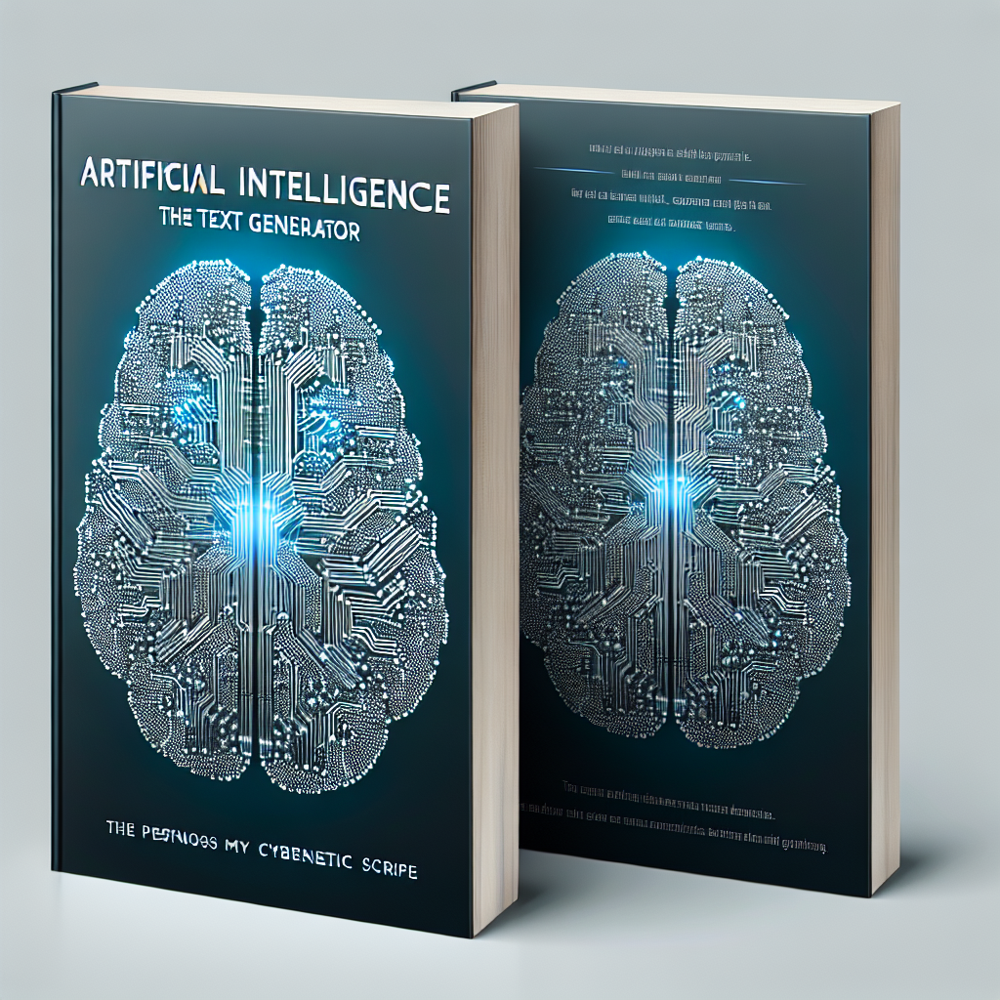

# LLM - Detect AI Generated Text

This is kaggle competition to classify texto into AI generated or as a human write.

Some useful informations:

- **Dataset**: 10,000 essays with some written by students and some generated by large language models (LLMs).
- **Objective**: Determine if an essay was generated by an LLM.
- **Essays respond to seven prompts**, with students instructed to read source texts before writing.
- **Training set**: Comprises essays from two prompts, mostly student-written with a few LLM-generated examples.
- **Hidden test set**: Comprises essays from the remaining prompts.
- **Reminder that it's a Code Competition**: The test data (`test_essays.csv`) is dummy data, to be replaced with a full test set of 9,000 essays (both student-written and LLM-generated) during scoring.
